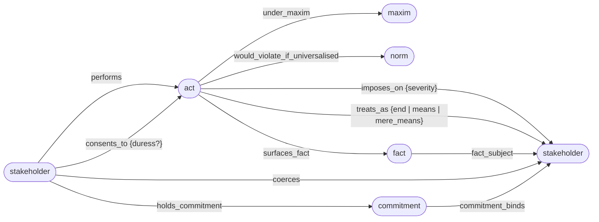
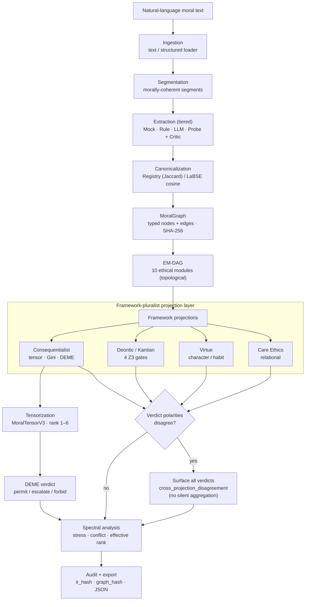
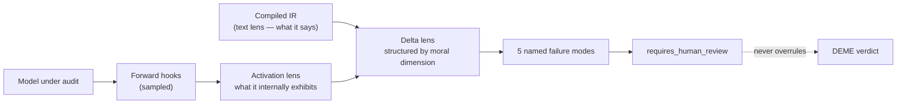

# ErisML Compiler

[](https://github.com/ahb-sjsu/erisml-compiler/actions/workflows/ci.yml)
[](https://opensource.org/licenses/MIT)
[](https://www.python.org/downloads/)
[](https://docs.pydantic.dev/)
[](SCOPE.md)
[](#status)
[](docs/architecture.md)
[](docs/architecture.md)
[-blueviolet)](docs/plans/release-planning-06-framework-pluralist-architecture.md)
[-blue)](docs/plans/release-planning-06-framework-pluralist-architecture.md)
[](https://github.com/astral-sh/ruff)
[](https://github.com/psf/black)
[](SCOPE.md)
[](https://pypi.org/project/erisml-compiler/)
[](https://doi.org/10.5281/zenodo.20659432)

A framework-pluralist DAG-native compiler from natural-language moral
material into a typed **MoralGraph** + a set of pluggable framework
**Projections**.

Inputs compile into a typed `MoralGraph` (nodes ∈ {stakeholder, act,
maxim, commitment, fact, norm}; edges ∈ {performs, imposes_on,
consents_to, treats_as, under_maxim, coerces, surfaces_fact,
fact_subject, would_violate_if_universalised}) carrying a canonical
SHA-256 hash. Four framework projections then read that graph via
typed queries:

- **ConsequentialistProjection** — the per-stakeholder harm/care
  tensor + Gini / worst-off / Shapley + DEME verdict.
- **DeonticProjection** — Kantian categorical *gates*
  (universalizability, mere_means, valid_consent, legitimate_authority)
  emitting categorical pass/fail findings, not channel contributions.
- **VirtueProjection** — Aristotelian character / habit-consistency
  reading.
- **CareEthicsProjection** — Gilligan / Noddings / Tronto relational
  primitives (attentiveness, asymmetric responsibility, dependency
  response).

The substrate every projection reads is a typed `MoralGraph` —
6 node kinds and 11 edge kinds, carrying a canonical SHA-256 hash:



When projections disagree by normalised verdict polarity, the
compiler **does not aggregate** — it surfaces all verdicts via
`ir.cross_projection_disagreement` and defers the choice to the
caller. That choice is itself a metaethical move; the compiler
refuses to make it silently.

The compiler operationalises the thesis that **moral reasoning
requires structure-preserving representation before decision
contraction**, and the design rejects the deeper claim that one
representation could be framework-neutral. The honest move is to
make the framework commitments first-class, comparable, and
explicit. See
`docs/plans/release-planning-06-framework-pluralist-architecture.md`
for the architectural argument and the r/Compiler review thread it
responds to.

Other v0.x stack:

- **Eigenvalue spectral scalar** + higher-rank mode-n unfolding for
  the V3 tensor (release-planning-04).
- **Named ethos profiles** (`--ethos-profile`) fit from Social Chem
  101 (Forbes et al., EMNLP 2020): `dear_abby_socialchem_v0.1`,
  `aita_socialchem_v0.1` (release-planning-05).
- **MoralTensor-Bench** harness + 3 seed scenarios + CLI
  `eris-compile bench run` (release-planning-03).
- **ρ-estimation core** (Procrustes + LSTSQ) for the BIP
  equivariance check (release-planning-02).
- **I-EIP Monitor** (three lenses + 5 named failure modes) plus
  calibration provenance + `--strict-v3` enforcement.

See `ErisML-Compiler.md` for the full design spec (31 sections) and
`SCOPE.md` for what each phase actually delivers versus what is
deferred.

## Quick start

```bash
# Install from PyPI
pip install erisml-compiler                        # core
pip install 'erisml-compiler[llm,calibration,monitor]'  # full stack

# Or, install from source (editable; choose extras as needed)
pip install -e ".[test,calibration,monitor,notebook]"

# Compile one of the bundled examples. Default: runs all 4 framework
# projections (consequentialist + deontic + virtue + care_ethics), emits
# both V2 moral_vectors and a DEME V3 MoralTensorV3, and surfaces
# cross-projection disagreement when framework verdict polarities differ.
eris-compile compile examples/nazi_attic.txt --rank 2 --out out/nazi_attic.ir.json

# Use a fitted ethos profile from Social Chem 101
eris-compile compile examples/nazi_attic.txt \
    --ethos-profile src/erisml_compiler/em_dag/profiles/dear_abby_socialchem_v0.1.yaml

# Select a subset of projections (deontic only)
eris-compile compile examples/nazi_attic.txt --projection deontic_kantian

# Run MoralTensor-Bench against the bundled seed corpus
eris-compile bench run --extractor rule --out-md out/bench_report.md

# Validate the IR
eris-compile validate out/nazi_attic.ir.json

# Export as an RLEF training record
eris-compile rlef out/nazi_attic.ir.json --out out/nazi_attic.rlef.json

# Run the activation lens (mock source for offline use)
eris-compile monitor "Soldiers at the door asking about hidden refugees." \
    --source mock --hidden-dim 64 --n-layers 8 \
    --out out/nazi_attic.trace.json

# Compare the two lenses — fires requires_human_review when they disagree
eris-compile delta out/nazi_attic.ir.json out/nazi_attic.trace.json \
    --out out/nazi_attic.delta.json

# Emit synthesizable Vitis HLS C++ for the silicon target
eris-compile silicon-emit --out-dir out/silicon

# Run the full test suite (462 tests across V3 alignment, projections,
# MoralGraph, ρ-estimation, social_chem, bench, virtue/care, etc.)
pytest

# Run the linters / formatters that CI uses
ruff check src tests
black --check src tests

# Quickstart notebook
jupyter notebook notebooks/quickstart.ipynb
```

## Architecture

The compiler implements the 12-pass pipeline from spec §12 with a tiered
extractor stack, a silicon-castable evaluation kernel, and the I-EIP Monitor
on top. Text is compiled into a typed `MoralGraph`; a framework-pluralist
projection layer then reads that graph, and disagreement is surfaced rather
than averaged away:



The I-EIP Monitor runs **out-of-band** on sampled audits — it compares what a
model *says* against what it *internally exhibits*, and can only ever raise
`requires_human_review`; it never overrules DEME:



Three extractor tiers cover the latency / faithfulness frontier:

- **Mock / Rule** — deterministic, real-time, silicon-castable.
- **LLM** — NRP OpenAI-compatible (`gpt-oss`, `qwen3`, etc.) or local vLLM,
  with a critic pass that flags off-canon outputs for `requires_human_review`.
- **Probe** — calibrated LaBSE-backed classifier head using
  sqnd-probe v10.16.9 methods: spectral decoupling, VIB, multi-head GRL
  adversarial, confusion loss.

Three lenses cover the alignment frontier:

- **Text lens** (Phases 1–3) — what the model *says*.
- **Activation lens** (Phase 4) — what the model *internally exhibits*
  at chosen transformer layers (forward hooks on Qwen2.5-7B-Instruct,
  LLaMA, Mistral, GPT-2, or BERT-family models).
- **Delta lens** (Phase 4) — where they disagree, structured by moral
  dimension, with five named failure modes
  (`text_internal_mismatch`, `layerwise_drift`, `group_symmetry_break`,
  `probe_uncertainty_spike`, `audit_chain_break`). Any firing sets
  `requires_human_review`; the Monitor never overrules DEME.

See `docs/i_eip_monitor.md` for the threat model, trust-boundary
diagram, and the precise semantics of each failure mode.

### Layered architecture

| Layer | Purpose |
|---|---|
| `ingestion/` | Load text from files or strings, attach metadata |
| `segmentation/` | Split text into morally-coherent segments |
| `annotation/` | Mock / Rule / LLM / Probe extractors + critic |
| `canonicalizer/` | Registry (Jaccard) + LaBSE cosine canonical-form snap |
| `ontology/` | YAML registries: dimensions, roles, commitments, canonical forms |
| `ir/` | Pydantic v2 IR schemas and validators |
| `em_dag/` | 10 ethical modules + topological DAG evaluator |
| `fsm/` | Commitment / Legitimacy / Consent finite-state machines |
| `evaluation/` | MoralVector / MoralTensor construction; conflict detection |
| `calibration/` | Probe training: losses, adversarial heads, VIB, bond index |
| `correction/` | IR diff + apply-corrections (RLEF feedback loop) |
| `erisml_backend/` | ErisML codegen and DEME bridge |
| `silicon/` | Fixed-point conversion + Vitis HLS C++ emitters (FSM + DAG) |
| `audit/` | SHA-256 hash chain and per-pass provenance |
| `export/` | JSON, ErisML source, RLEF training records |
| `viz/` | HTML report + timeline plot |
| `streaming/` | Real-time captioner of pipeline events |
| `monitor/` | I-EIP Monitor activation lens: ActivationSource + ActivationProbe + IEIPMonitor |
| `delta/` | Delta lens: compare_morals, BIP equivariance check, 5-mode failure detector |
| `cli.py` | 12 subcommands: `bundle calibrate compile correct delta diff monitor report rlef silicon-emit validate version` |

### What is NOT yet in `main`

See `SCOPE.md` for the full list. Headline in-flight items:

- **Production web app** (deferred from the Phase 4 redirect to the I-EIP Monitor)
- **NRP runtime deployment** (orchestrator + pod templates)
- **Silicon hardware verification** on the Xilinx U55C target — Vitis HLS C++
  is emitted and builds; on-FPGA bring-up is gated by the NRP Coder bitstream
  pipeline (see `project_epu_phase3_hw_blocked` in the user's notes).

## Project layout

```
erisml-compiler/
  ErisML-Compiler.docx        # Original design spec (31 sections)
  ErisML-Compiler.md          # Same, converted to Markdown
  SCOPE.md                    # What is built / stubbed / deferred
  README.md                   # This file
  LICENSE                     # MIT
  pyproject.toml              # Extras: [llm] [calibration] [monitor] [test] [dev] [notebook]
  src/erisml_compiler/
    cli.py
    ingestion/  segmentation/  annotation/  ontology/  ir/  evaluation/
    em_dag/     fsm/           canonicalizer/          correction/
    calibration/  monitor/  delta/  silicon/  erisml_backend/
    audit/        export/   viz/    streaming/
  examples/
    nazi_attic.txt
    medical_confidentiality.txt
    whistleblower.txt
  tests/                      # 462 tests across 41 files
  notebooks/quickstart.ipynb
  docs/
    architecture.md           # runtime architecture (12-pass pipeline, Mermaid)
    i_eip_monitor.md          # I-EIP Monitor threat model & trust boundaries (Mermaid)
    silicon_target.md         # Vitis HLS C++ emission for the U55C target
    nrp_coder_deployment.md   # NRP Coder workspace + bitstream build
    migration/                # DEME V3 alignment (six-phase)
    eval/                     # ground-truth evaluation methodology
    plans/                    # release-planning 02–07 (design arguments)
    articles/                 # public write-ups
  scripts/atlas/
    probe_models.py           # Recon: enumerate HF + GGUF models on Atlas
```

## DEME V3 alignment

> **Canonical MoralVector spec:** dimensions + xBSE feeders + tensor mapping + evidence in
> `erisml-lib/docs/moralvector_reference.md`; standards architecture in
> `erisml-lib/docs/moralvector_v2_architecture.md`. The V2→V3 (10→9) migration is in
> `ir/v3/migration.py`, guarded by `tests/test_dimension_consistency.py`.

The original V2 IR carries 10 moral dimensions and a rank-2 per-stakeholder
`MoralTensor`. **DEME V3** (`erisml-lib`) speaks a different shape:
9 dimensions derived from the *Nine Dimensions of Ethical Assessment* 3×3
matrix, tensors at ranks 1–6 over axes `(k, n, τ, a, c, s)` (dimension /
stakeholder / time / action / coalition / uncertainty sample), per-party
verdicts, distributional veto locations, Gini + worst-off fairness
metrics, and a sprint-tiered module hierarchy (Constitutional,
Core Safety, Rights/Fairness, Soft Values, Meta-Governance).

The compiler is fully aligned with DEME V3 over a documented six-phase
migration (`docs/migration/deme_v3_alignment.md`). All six phases shipped:

| Phase | Deliverable |
|---|---|
| 1 | `MoralTensorV3` Pydantic schema with rank/shape/axes/values + V2→V3 migration helpers |
| 2 | Orchestrator produces `ir.moral_tensor_v3` at the requested rank; `--rank N` CLI flag |
| 3 | Bridge wires the IR through `EthicalFactsV3` and invokes registered V3 modules (Geneva, Triage) |
| 4 | Per-party facts built directly from `EthicalFact.subjects`; per-party verdicts and Gini surfaced on the IR; `requires_human_review` is now per-stakeholder |
| 5 | Ranks 3–6 with temporal (τ via event-timeline filtering), coalition + action axes (a, c — currently stub axes), and Monte Carlo over fact confidence (s); `--rank N` + `--n-{actions,coalitions,samples}` CLI flags |
| 6 | Real `CoalitionContext` semantics on the c axis (`--coalition-mode all_subsets`); Shapley attribution + welfare metrics on `ir.strategic_analysis`; hash-chained `DecisionProof` on `ir.decision_proof` linking to `audit.ir_hash`. **V3 migration complete.** |

After Phase 6, `CompilerIR` carries six V3 surface fields:

```python
ir.moral_tensor_v3       # MoralTensorV3, ranks 1-6
ir.per_party_verdicts    # dict[stakeholder_id, str]
ir.fairness_metrics      # dict with gini_harm + worst_off_harm_value
ir.strategic_analysis    # dict with shapley_values + welfare_metrics
ir.decision_proof        # dict with hash-chained provenance
ir.schema_version        # "erisml_compiler_ir_v0.3"
ir.graph                 # MoralGraph (DAG-native substrate; v0.8.0)
ir.projections           # dict[framework_id, ProjectionResult] (v0.8.0)
ir.cross_projection_disagreement  # framework polarity disagreement (v0.8.0)
ir.audit.graph_hash      # canonical SHA-256 over the moral graph
```

The V2 surface remains alive — `moral_vectors`, `moral_tensors`, the V2
EM-DAG — so existing IRs still parse and the legacy `MoralVector` API still
works. The V2 fields may be deprecated in a future major version after
the silicon and Monitor paths migrate.

## Status

**v0.9.0 — alpha. Production-grade Kantian + virtue analysers on top
of the v0.8.0 framework-pluralist DAG-native architecture: spaCy SRL
maxim extraction, Z3-based universalizability solver, SQLite habit
store, temporally-weighted virtue assessment. 462 tests passing**
across IR (V2 + V3), EM-DAG (now graph-native), FSMs, canonicalizer,
critic, correction, calibration, export (RLEF v0.2), silicon emit,
activation lens, delta lens, equivariance, ρ-estimation, failure-mode
detectors, V3 schema/pipeline/bridge/higher-rank/strategic/decision-
proof, MoralGraph (canonical hash + flat round-trip), projections
(consequentialist + deontic + virtue + care), social_chem ethos
fitter, MoralTensor-Bench harness. CI green on Ubuntu × Python
3.10/3.11/3.12; ruff lint + black format checks both clean.

End-to-end verified on the bundled `nazi_attic` example:

- **NRP LLM integration**: the LLM picks the wrong canonical form, the
  canonicalizer corrects it, the critic pass triggers
  `requires_human_review`.
- **I-EIP Monitor**: divergence 0.70, 6 direction breaks, two failure
  modes fire, `requires_human_review=True`.
- **DEME V3 rank-2**: per-party harm splits cleanly — speaker 0.76
  (forbid), village 0.83 (forbid), nazis 0.18 (neutral), refugees 0.0
  (prefer). Gini over harm = 0.43, worst-off = village.
- **Strategic analysis**: Shapley values per stakeholder = `{speaker:
  7.11, refugees: 7.70, nazis: 7.88, village: 7.18}`, exact computation.
- **DecisionProof**: SHA-256 `proof_hash` chains to the IR's
  `audit.ir_hash`; forbidden options = `[speaker, village]`; layer
  outputs = `[v3_bridge, strategic]`.
- **Rank-4 with real coalitions** (`--coalition-mode all_subsets
  --n-coalitions 4`): c-axis std = 0.43 (real per-coalition variation),
  a-axis std = 0 (still stub — actions require IR additions).
- **Vitis HLS C++ emit** for FSMs + EM-DAG (NRP Coder bitstream blocked
  separately — see SCOPE.md).

## Current limitations

The project is **alpha**. The contract surface is intentionally honest
about what isn't yet load-bearing. See `SCOPE.md` for the full
component truth table.

- **Probe calibration is uncalibrated by default.** Random-init
  `ActivationProbe` instances mark themselves
  `is_calibrated=False` in trace provenance, but the I-EIP Monitor's
  numeric output is therefore noise. Calibrated checkpoints against a
  real moral-language corpus are pending (next milestone — see
  `docs/plans/release-planning-01.txt`).
- **Equivariance check is identity-ρ only.** The shipped delta-lens
  invariance test uses `ρℓ(g) = identity` with surface-form rewrites
  (whitespace / case / punctuation). The full I-EIP representation-map
  framework (paraphrase, role swap, unit change, etc., with
  ρℓ estimated over activation pairs) is future work.
- **The `a` (action) axis on ranks 4-6 is a stub.** It has parametric
  length but values replicate. The `c` (coalition) axis is real (four
  enumeration modes). Genuine action semantics require IR additions
  outside this migration's scope.
- **Silicon emit is C++ only — no FPGA bring-up.** Vitis HLS sources
  are produced and verified through hardware emulation (70/70 PASS),
  but on-FPGA bitstreams are gated by the NRP Coder pipeline.
- **No standalone benchmark.** Validation runs on three bundled
  scenarios (nazi_attic, medical_confidentiality, whistleblower). A
  named MoralTensor-Bench v0.1 is the next milestone.
- **erisml-lib (DEME V3) not yet on PyPI.** Install from source until
  publication; `pip install 'erisml-compiler[deme-v3]'` documents the
  dependency but doesn't transitively install it.
- **`--strict-v3` exists for a reason.** Without it, V3 dispatch
  failures silently fall back to the V2 migration builder. Research
  and production runs should pass `--strict-v3` so a regression in
  the bridge can't quietly downgrade the result.
- **The IR substrate still encodes choices, even after the two-layer
  + DAG refactor.** The compiler now compiles into a typed
  `MoralGraph` (nodes ∈ {stakeholder, act, maxim, commitment, fact,
  norm}; edges ∈ {performs, imposes_on, consents_to, treats_as,
  under_maxim, coerces, ...}) with a canonical SHA-256 hash in the
  audit chain. Projections read the graph via typed queries
  (currently `ConsequentialistProjection` and `DeonticProjection`).
  When projections disagree, the compiler surfaces both verdicts
  via `ir.cross_projection_disagreement` and refuses to aggregate
  silently. But the substrate's *extraction categories* (we extract
  stakeholders, commitments, maxims; we don't extract, say, virtues
  or relational-care states) are themselves choices. The
  metaethical commitment shrank; it didn't vanish. See
  `docs/plans/release-planning-06-framework-pluralist-architecture.md`
  for the architectural argument and the limitations of the v0
  Kantian gate implementation.

## Reproduce the bundled example

```bash
make reproduce-nazi-attic
```

emits IR + RLEF record + V3 tensor + DEME verdict + audit hash +
Monitor trace + Delta report + HTML report + audit bundle + plain-text
summary in `out/reproduce_nazi_attic/`. Idempotent; safe in CI.

## Research & papers

This compiler and the DEME engine (`erisml-lib`) are the worked instance of **Philosophy
Engineering** — the practice of building executable, falsifiable, and auditable implementations
of normative frameworks: declared modeling assumptions, stated invariances, *tested*
predictions, and versioned revision.

- **Keystone paper** (draft; targets AIES 2027) — *ErisML and DEME: A Structure-Preserving,
  Framework-Pluralist Pipeline for Auditable Machine Ethics*: [`paper/keystone/`](paper/keystone/).
  Ships reproducible companion notebooks (AITA governance demo; MFRC external validation).
- **External validation** — DEME's moral dimensions track *independent human* moral-foundation
  labels (Moral Foundations Reddit Corpus): each pre-registered dimension aligns with, and is
  most correlated with, its intended foundation (care↔Care, fairness↔Equality,
  legitimacy↔Authority, fidelity↔Loyalty; ρ≈0.43–0.53), replicated across two model families,
  with distinct instruments agreeing on a shared core (ρ=0.88). See
  [`paper/keystone/mfrc_validation.ipynb`](paper/keystone/mfrc_validation.ipynb).
- **Workshop (proposed)** — an AIES 2027 workshop on Philosophy Engineering:
  [`paper/aies_workshop/`](paper/aies_workshop/).
- **Related peer-reviewed work** — manipulation detection in LLM moral judgment (IEEE
  BigDataService 2026, accepted); per-stakeholder content moderation with DEME (IEEE TCSS,
  under review).

## Citing

If you use this work academically, please cite via the Zenodo DOI. The
**concept DOI** always resolves to the latest release; the version DOI
pins a specific release.

```bibtex
@software{bond2026erisml,
  author    = {Bond, Andrew H.},
  title     = {ErisML Compiler: A Structure-Preserving Compiler from
               Natural Language to a Moral Intermediate Representation},
  year      = {2026},
  version   = {0.9.0},
  doi       = {10.5281/zenodo.20659432},
  url       = {https://github.com/ahb-sjsu/erisml-compiler}
}
```

- **Concept DOI** (latest): https://doi.org/10.5281/zenodo.20659432
- **v0.4.0 DOI**:           https://doi.org/10.5281/zenodo.20659433

## License

MIT. See `LICENSE`.
