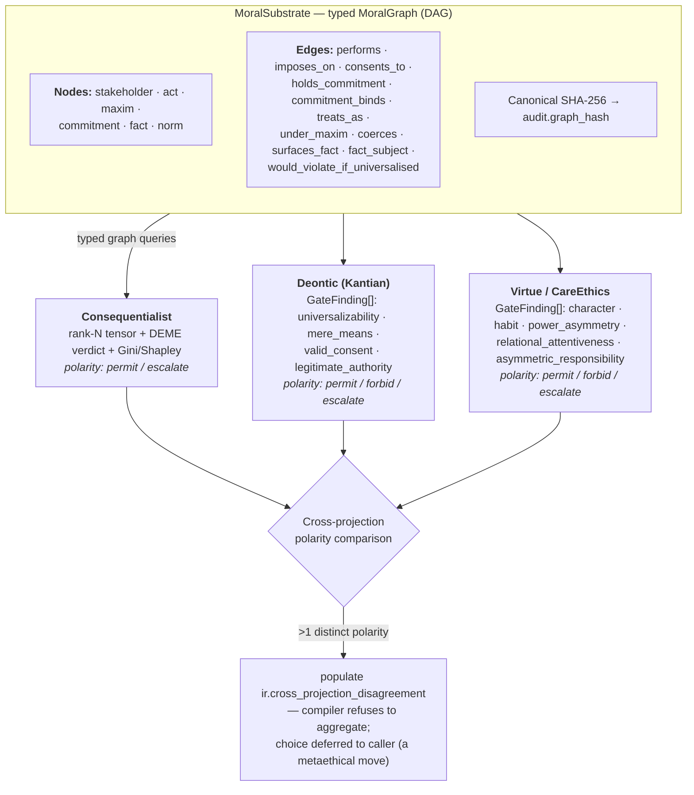
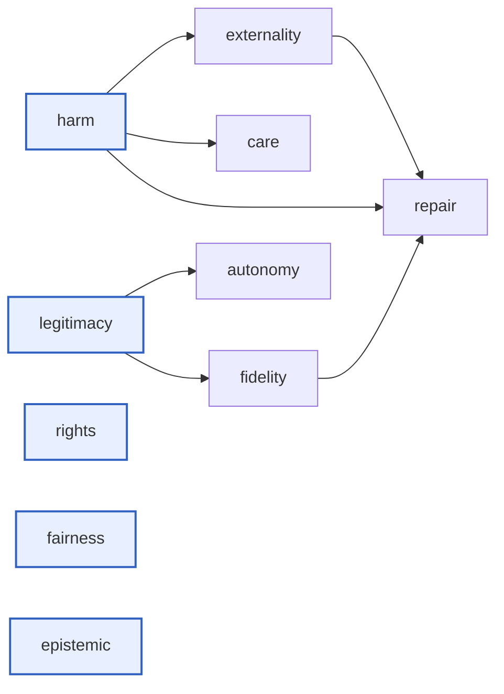

# Architecture (v0.9.0)

This document describes the runtime architecture of the ErisML
Compiler as of `main` at v0.9.0 (the framework-pluralist DAG-native
architecture introduced in v0.8.0, with the v0.9.0 production Kantian +
virtue analysers on top). For the original 31-section design
spec see `ErisML-Compiler.md`. For per-component delivery status see
`SCOPE.md`. For the I-EIP Monitor threat model see
`docs/i_eip_monitor.md`. For the architectural argument behind the
v0.8.0 refactor see
`docs/plans/release-planning-06-framework-pluralist-architecture.md`.

## One-paragraph summary

Text compiles into a typed `MoralGraph` (the descriptive substrate)
with a canonical SHA-256 hash anchored in the audit chain. Multiple
framework `Projection` strategies read that graph and emit
framework-relative verdicts. When projections disagree by normalised
polarity, the compiler refuses to aggregate and surfaces all
verdicts explicitly. Backward compat layers keep the legacy flat-
field IR (`ir.stakeholders`, `ir.moral_tensor_v3`, `ir.deme_verdict`)
populated so existing consumers continue to work.

## The two-layer split



The substrate is descriptive (who did what to whom, with what
authority, under what existing commitments). The projections are
framework-bound — each emits the kind of analytical object its
framework actually produces (a per-stakeholder tensor for
consequentialists, categorical gate findings for Kantians,
character-axis assessments for virtue ethicists, relational
findings for care ethicists). The compiler never silently
aggregates across frameworks because aggregation is itself a
metaethical move.

## MoralGraph schema

`src/erisml_compiler/ir/graph/`

```python
class NodeKind(str, Enum):
    STAKEHOLDER = "stakeholder"
    ACT         = "act"
    MAXIM       = "maxim"        # the action under its description
    COMMITMENT  = "commitment"
    FACT        = "fact"
    NORM        = "norm"

class EdgeKind(str, Enum):
    PERFORMS          = "performs"           # stakeholder → act
    IMPOSES_ON        = "imposes_on"         # act → stakeholder (payload: severity, confidence)
    CONSENTS_TO       = "consents_to"        # stakeholder → act (payload: given, under_duress, informed)
    HOLDS_COMMITMENT  = "holds_commitment"   # stakeholder → commitment
    COMMITMENT_BINDS  = "commitment_binds"   # commitment → stakeholder (beneficiary)
    TREATS_AS         = "treats_as"          # act → stakeholder (payload: role ∈ {end, means, mere_means})
    UNDER_MAXIM       = "under_maxim"        # act → maxim
    COERCES           = "coerces"            # stakeholder → stakeholder
    SURFACES_FACT     = "surfaces_fact"      # act → fact
    FACT_SUBJECT      = "fact_subject"       # fact → stakeholder
    WOULD_VIOLATE_IF_UNIVERSALISED = "would_violate_if_universalised"  # act → norm
```

Node and edge payloads carry the original Pydantic-model contents
verbatim (`Stakeholder.model_dump()`, `Event.model_dump()`, etc.) so
the typed-graph view loses no information.

### Canonical hashing

`ir/graph/canonical.py` produces a deterministic JSON encoding (nodes
sorted by id, edges sorted by `(src, dst, kind, payload-json)`, label
lists sorted, payload keys sorted) and an SHA-256 over it. The same
nodes-and-edges content produces the same hash regardless of
insertion order. Anchored in `AuditRecord.graph_hash`.

### Bidirectional derivation

- `graph_from_flat(ir) -> MoralGraph` — orchestrator Pass 7.5; reads
  the flat extractor output and synthesises typed nodes + edges.
  Heuristically derives `imposes_on`, `treats_as[role=mere_means]`,
  `coerces`, and a `maxim` node + `under_maxim` edge from
  ethical-fact kinds + role labels. The heuristic step lives in
  `ir/graph/promote.py` and will be replaced by direct extractor
  emission as Tier 3 / probe extractors mature.
- `flat_from_graph(graph) -> dict[str, list[…]]` — reads node
  payloads back into `Stakeholder`/`Event`/`Commitment`/`Norm`/
  `EthicalFact` lists sorted by id. Bit-stable: hash(graph) ==
  hash(graph_from_flat(flat_from_graph(graph))) for every
  bundled example.
- `ExtractorResult.graph: MoralGraph | None` — extractors can emit
  the graph directly during extraction. When populated, the
  orchestrator skips Pass 7.5 and uses the extractor's emission as
  the source of truth. The `RuleExtractor` populates this field
  using the same `graph_from_flat` machinery at its result boundary;
  future LLM extractors will construct nodes and edges natively from
  prose.

## Projection layer

`src/erisml_compiler/projections/`

Each `Projection` reads a `MoralSubstrate` (which itself is a view
over the `MoralGraph`) and returns a `ProjectionResult` with:

- `framework: str` — stable identifier (e.g. `deontic_kantian`)
- `verdict: str` — framework-native verdict string
- `polarity: VerdictPolarity` — normalised to
  `{permit, forbid, escalate, neutral}` for cross-framework
  comparison
- `findings: list[GateFinding]` — categorical pass/fail findings
  (used by Kantian, virtue, care; empty for consequentialist where
  the analysis lives in the tensor)
- `framework_specific: dict` — framework-bound output (tensor +
  Gini for consequentialist; virtue-trait surfaces for virtue)
- `metadata: dict` — provenance (graph_aware flag, graph_summary,
  fit_method)

### The four shipped projections

| Projection | Reads | Emits | Verdict polarities |
|---|---|---|---|
| **`ConsequentialistProjection`** | Substrate + graph + EM-DAG outputs | rank-N `MoralTensorV3` + DEME verdict + Gini/Shapley | `permit` / `escalate` |
| **`DeonticProjection`** | `treats_as` edges, `imposes_on`/`consents_to` edges, maxim's `action_kind` | 4 `GateFinding`s (universalizability, mere_means, valid_consent, legitimate_authority) | `permit` / `forbid` / `escalate` |
| **`VirtueProjection`** | maxim.action_kind, commitment count, vulnerable-stakeholder `imposes_on` targets | 3 `GateFinding`s (character_consistency, commitment_context, power_asymmetry) | `permit` / `forbid` / `escalate` |
| **`CareEthicsProjection`** | relations, dependents, `imposes_on` to dependent-labelled nodes | 3 `GateFinding`s (relational_attentiveness, asymmetric_responsibility, dependency_response) | `permit` / `forbid` / `escalate` |

### Cross-projection disagreement

`ir.cross_projection_disagreement` is populated iff ≥2 projections
emit distinct polarities (after filtering out `neutral`).
Comparison is intentionally on **polarity**, not on the framework-
native verdict string: `permitted` / `permissible` / `virtuous` /
`caring` all map to `permit`, so vocabulary differences across
frameworks do not register as fake disagreement.

The structure of the field:

```python
{
  "verdicts": {framework_id: native_verdict_str, …},
  "polarities": {framework_id: "permit"|"forbid"|"escalate", …},
  "note": "Frameworks disagree on this case. The compiler surfaces …"
}
```

The compiler does **not** populate a winner. Choosing across
projections is the caller's responsibility and is itself a
metaethical move.

## The 12-pass pipeline

Implemented in `pipeline/orchestrator.py:compile_document()` (invoked by
`cli.py:cmd_compile`); the same flow is rendered as a Mermaid diagram in the
README.

| Pass | Stage | Implementation |
|---|---|---|
| 0 | Ingestion | `ingestion/text_loader.py` (Tier 2/3) or `structured_loader.py` (Tier 1) |
| 1 | Segmentation | `segmentation/segmenter.py` |
| 2–7 | Extraction (entity, stakeholder, event, norm, ethical fact) | `annotation/{mock,rule,llm,probe}_extractor.py` + `annotation/critic.py` |
| 7 | Canonical-form resolution | `canonicalizer/` (Jaccard registry → LaBSE cosine snap) |
| **7.5** | Graph identity | `ir/graph/promote.py:graph_from_flat()` — promote flat extractor output to `MoralGraph`, compute `graph_hash`. Skipped when the extractor provided `result.graph`. |
| 8 | EM-DAG evaluation | `em_dag/dag.py:EMDAG.evaluate()` — 10 ethical modules, topological order |
| **8.5** | Projection pass | `projections/` — run every enabled framework projection over the substrate; back-fill legacy `ir.moral_tensor_v3` / `ir.deme_verdict` / etc. from `projections["consequentialist_distributive"]` for backward compat |
| 9 | Tensorization | `evaluation/tensor_builder_v3.py:build_moral_tensor_v3()` → `MoralTensorV3` (rank 1–6) |
| 10 | DEME verdict | `erisml_backend/deme_bridge.py:DEMEBridge.evaluate()` → `DEMEVerdict` |
| 11 | Spectral analysis | `evaluation/spectral.py` — principal stress / conflict / effective moral rank |
| 12 | Audit + export | `audit/hash_chain.py:finalize_audit()` (incl. `graph_hash`, `ethos_profile`) + `export/json_export.py` |

## Audit chain extensions

`AuditRecord` (v0.8.0) carries:

- `ir_hash` — sha256 over the canonical-JSON IR (excluding audit
  itself)
- `source_text_hash` — sha256 of the input text
- `compiler_version`, `schema_version` (`erisml_compiler_ir_v0.3`)
- `tier`, `extractor`
- `em_profile` — DAG profile name (which modules + their deps)
- `ethos_profile`, `ethos_profile_sha256` — name + YAML hash of the
  fitted ethos profile, when `--ethos-profile` was applied
- `graph_hash` — canonical SHA-256 over the `MoralGraph`
- `timestamp_utc`
- `passes` — per-pass timing + status

The chain composes: identical input + extractor + profiles produces
identical `graph_hash` and `ir_hash`. Two compiles of the same
case yield bit-identical audit records.

## EM-DAG (consequentialist evaluator)

`src/erisml_compiler/em_dag/`

10 ethical modules feed the consequentialist projection's tensor.
Roots have no dependencies; edges point from a module to the module
that depends on it (topological evaluation order):



A different deployment can swap in a different DAG by writing a new
YAML profile under `em_dag/profiles/` and passing
`--em-profile path/to/profile.yaml`. The topology is the DEME
profile.

### Graph-native helpers (v0.8.0)

The EM modules call helpers (`facts_of_kind`, `active_commitments`,
`vulnerable_stakeholders`, `nonconsenting_third_party_ids`,
`stakeholders_with_role`) defined in `em_dag/modules/_helpers.py`.
Each helper prefers `MoralGraph` queries when `ir.graph` is set and
falls back to flat-field reads otherwise. The
`nonconsenting_third_party_ids` helper specifically reads
`IMPOSES_ON` edges without paired `CONSENTS_TO` edges — the typed-
edge semantic, not role-label string matching.

The graph-native port preserves verdicts byte-identically against
the pre-v0.8.0 flat baseline on every bundled scenario (golden test
in `tests/test_em_dag_graph_native.py`).

## FSM layer (Tier 1 / silicon target)

`src/erisml_compiler/fsm/` — three deterministic finite-state
machines:

- `CommitmentFSM` — vow lifecycle
  (active → defeasible → defeated/violated/fulfilled/void/expired)
- `LegitimacyFSM` — authority legitimacy
  (fully_legitimate → defeasible/coercive/fraudulent → tyrannical/void)
- `ConsentFSM` — consent
  (not_obtained → obtained/coerced → withdrawn)

Each FSM fits in a small state register (3 bits). Terminal states
are absorbing. In silicon, the entire moral-state vector is bounded
by `O(n_commitments + n_authorities + n_consenters)` registers.

## Ethos profiles (`--ethos-profile`)

`src/erisml_compiler/social_chem/`

Fitted per-EM-module weight profiles loaded via the
`--ethos-profile` flag. Two bundled profiles fit from Social Chem
101 (Forbes et al., EMNLP 2020):

- `dear_abby_socialchem_v0.1.yaml`
- `aita_socialchem_v0.1.yaml`

Each profile carries:
- `weights: dict[module_name, float]` — applied at the consequentialist
  projection's MoralVector projection step (unmapped modules
  implicitly default to weight 1.0)
- `priors: dict[module_name, float]` — empirical per-module mean
- `coverage: dict[module_name, float]` — per-module salience fraction
- `corpus_fingerprint` (sha256, n_situations, license, citation)
- `bias_notes: list[str]` — explicit known limitations (MTurk
  demographics, MFT coverage gaps, audience self-selection, …)

The profile's `name` and YAML `sha256` are recorded in
`ir.audit.ethos_profile` and `ir.audit.ethos_profile_sha256` so
the audit chain captures which ethos was applied.

## I-EIP Monitor (`monitor/`, `delta/`)

Activation-side complement to the text-side IR. Three lenses:

- **Text lens** — `ir.projections["consequentialist_distributive"]`'s
  MoralVector + tensor.
- **Activation lens** — calibrated per-layer `ActivationProbe`
  outputs from forward hooks on (Qwen2/3, LLaMA, Mistral, GPT-2,
  BERT). Three concrete sources: `MockActivationSource`,
  `HuggingFaceActivationSource`,
  `RemoteAtlasActivationSource` (paramiko).
- **Delta lens** — `delta/compare.py:compare_morals(text, activation)`
  + the BIP equivariance test
  `h_ℓ(g·x) ≈ ρ_ℓ(g)·h_ℓ(x)` with optional learned ρ_ℓ via the
  `delta/rho_estimation.py` Procrustes + LSTSQ estimators.

Five named failure modes (`delta/failure_modes.py`) fire
`requires_human_review`: `text_internal_mismatch`,
`layerwise_drift`, `group_symmetry_break`,
`probe_uncertainty_spike`, `audit_chain_break`, plus
`rho_non_orthogonal` (added with the ρ estimation work). The
Monitor never overrules a projection's verdict.

## RLEF export (schema v0.2)

`src/erisml_compiler/export/rlef.py`

Every RLEF record now includes:

```jsonc
{
  "schema": "rlef_v0.2",
  "source_text": "…",
  "moral_graph": {                  // NEW v0.8.0
    "graph_hash": "…",
    "canonical_json": "…",
    "nodes": [...],
    "edges": [...],
    "node_counts": {...},
    "edge_counts": {...}
  },
  "projections": {                  // NEW v0.8.0 — all 4 framework results
    "consequentialist_distributive": {...},
    "deontic_kantian": {...},
    "virtue_aristotelian": {...},
    "care_ethics_relational": {...}
  },
  "cross_projection_disagreement": {...},   // when present
  "stakeholders": [...],            // backward compat
  "commitments": [...],
  "ethical_facts": [...],
  "moral_vector_timeline": [...],
  "deme_verdict": {...},
  "em_outputs": {...},
  "audit": {...},
  "human_corrections": null
}
```

Trainers can learn against the typed graph, per-framework verdicts,
or the flat tensor timeline — whichever fits their objective.

## MoralTensor-Bench

`src/erisml_compiler/bench/`

A named benchmark for evaluating structural fidelity. v0.1 ships
with three seed scenarios (`nazi_attic_001`,
`medical_confidentiality_001`, `whistleblower_001`) and seven
per-metric scorers: stakeholder recall, role F1, commitment F1,
canonical-form match, ethical-fact-kind recall, per-party verdict
accuracy, overall verdict match, plus a premature-contraction
penalty. CLI:

```bash
eris-compile bench run --bench-dir src/erisml_compiler/bench/v0.1 \
    --extractor rule --out-md out/bench_report.md
```

Baseline score on the seed corpus with the rule extractor: 0.136.
The score reflects extractor coverage gaps (semantic stakeholder IDs
in the bench gold vs. the rule extractor's generic IDs), not a
projection failure.

## Backward compatibility

All v0.8.0 changes are additive. Existing IRs deserialise without
error; the new `graph` / `projections` / `cross_projection_disagreement`
fields default to `None` / empty.

Legacy fields stay populated:
- `ir.moral_vectors[0]` ← consequentialist projection's vector
- `ir.moral_tensor_v3` ← consequentialist projection's tensor
- `ir.timeline` ← consequentialist projection's timeline
- `ir.em_outputs` ← consequentialist projection's EM outputs
- `ir.deme_verdict` ← consequentialist projection's verdict
- `ir.per_party_verdicts`, `ir.fairness_metrics` ← same
- `ir.stakeholders`, `ir.commitments`, `ir.events`, etc. ← derived
  from the graph (or directly populated by the extractor)

New code should read `ir.graph` and `ir.projections` directly. Old
code keeps working unchanged.

## Trust boundaries

| Boundary | Trusted side | Untrusted side | Mediator |
|---|---|---|---|
| Text input | compiler | user-supplied text | extractor + canonicalizer |
| LLM output (Tier 3) | compiler | LLM | critic + canonicalizer + IR validators |
| Probe output (Tier 2.5) | compiler | probe checkpoint | `CalibrationProvenance` (probe sha256, training corpus hash, calibration metrics) anchored to monitor trace |
| Activation source (Monitor) | compiler | remote inference host | paramiko + literal harness string (no remote `git pull`) |
| Ethos profile (`--ethos-profile`) | compiler | YAML on disk | YAML sha256 recorded in `audit.ethos_profile_sha256` |
| Audit chain | compiler | downstream consumer | `ir_hash`, `graph_hash`, `decision_proof.proof_hash` (Phase 6) |

## What this architecture is NOT

- **Not metaethically neutral.** The substrate's extraction
  categories (stakeholders, maxims, commitments, ethical facts, …)
  are themselves choices. The metaethical commitment shrank
  relative to pre-v0.8.0 (which baked in dimension + per-stakeholder
  + Gini aggregation as the only output shape) — it didn't vanish.
- **Not a moral authority.** The compiler emits structured findings
  from N frameworks and *refuses to choose* between them when they
  disagree. That choice is left to the caller as an explicit
  metaethical move.
- **Not a complete Kantian / virtue / care analyser.** The shipped
  gates and findings are v0 heuristic implementations
  (rule-list-based universalizability, action-kind-to-virtue-axis
  mapping, role-label-based dependency detection). Production
  implementations need richer maxim extraction, universalised-world
  contradiction tests, and longitudinal habit tracking — all
  tractable; none are shipping in v0.8.0.
- **Not a replacement for human judgment.** The I-EIP Monitor's
  only authorised output on failure is `requires_human_review`, not
  a verdict override. The projections produce *structured findings*
  intended to support human deliberation, not foreclose it.

See `release-planning-06-framework-pluralist-architecture.md` for
the architectural argument behind these commitments, and
`release-planning-07-graph-consumer-migration.md` for the migration
matrix of which consumers were ported and which are deferred.
