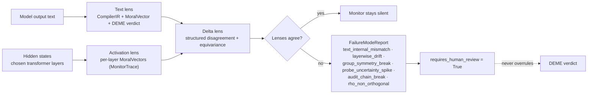

# I-EIP Monitor — Internal / External / Internal Probe lenses

The I-EIP Monitor is Phase 4 of the ErisML Compiler. It closes the loop
between *what a model says* (the text lens, Phases 1–3) and *what a model
internally exhibits* (the activation lens, Phase 4). When the two
disagree, the Monitor's only authorised output is to raise
`requires_human_review` and emit a structured report. **It does not
overrule DEME and it does not produce verdicts.**

## The three lenses

| Lens | Question it answers | Inputs | Output |
|---|---|---|---|
| **Text** (Phases 1–3) | What is the moral content of the model's output? | Model output text | `CompilerIR` with `MoralVector` + DEME verdict |
| **Activation** (Phase 4, Track A) | What is the moral state of the model's internals? | Hidden states from chosen transformer layers | `MonitorTrace` with per-layer `MoralVector`s |
| **Delta** (Phase 4, Track B) | Where do the two disagree, and is the disagreement structured? | Text + Activation MoralVectors, optional equivariance report | `DeltaResult` + `FailureModeReport` |

The aggregation across lenses is intentionally coarse. Each lens has its
own probe head; the Delta lens does not collapse them into a single
score. When the lenses agree the Monitor stays silent. When they
disagree, it surfaces the disagreement structure rather than picking a
winner.



## Threat model

The Monitor's authority depends on three pieces of trust, and each is
worth stating explicitly.

### T1. Probe poisoning

A trained `ActivationProbe` is itself a machine-learning model — its
weights can be corrupted at training time (`eris-compile calibrate`),
serialisation time (a tampered `.pt` checkpoint), or load time (a
substituted file path). A poisoned probe can be tuned to report low
moral signal on activations that actually encode high moral risk,
defeating the entire activation lens.

**Mitigations**:

- All probe checkpoints are loaded via
  `ActivationProbe.load_head_state`, which validates shape and key
  layout against the live architecture. Mismatched shapes raise rather
  than silently load.
- Checkpoints should be SHA-256 hashed and the hash recorded in the
  audit chain. The `MonitorTrace.trace_hash()` method covers the
  per-trace output side; checkpoint provenance is the caller's
  responsibility (recommendation: pin to a git tag).
- The equivariance check (Track B) is independent of the probe — it
  inspects the *underlying model's* hidden states for invariance under
  meaning-preserving rewrites. A poisoned probe cannot fake a passing
  equivariance result for an input whose hidden states actually moved.

### T2. Activation spoofing

The `RemoteAtlasActivationSource` runs a Python harness on a remote host.
The harness loads an HF model and forwards activations back over SSH.
A compromised remote could return synthetic activations chosen to
elicit a particular probe response.

**Mitigations**:

- The harness is a literal string baked into the source — there is no
  remote `git pull` step at runtime. The trust boundary is the SSH
  user account, not the codebase.
- For sustained workloads, run the compiler *on Atlas directly* with
  `HuggingFaceActivationSource` rather than driving it remotely. Remote
  is for development.
- The activation lens output for any single input is hash-anchored via
  `MonitorTrace.trace_hash()`; an audit chain over multiple inputs
  detects after-the-fact tampering.

### T3. Group-action ambiguity

The BIP equivariance check (`delta/equivariance.py`) tests
`h_ℓ(g · x) ≈ ρ_ℓ(g) · h_ℓ(x)` with `ρ_ℓ(g) = identity`. The implicit
assumption is that the rewrites supplied (lowercasing, whitespace
normalisation, synonym swaps, paraphrases) preserve moral semantics. If
the rewrite catalogue is buggy — e.g., a "synonym" swap that flips
polarity in the supplied context — the equivariance test will *itself*
fire spuriously, looking like a model failure when in fact it is a
rewrite-catalogue failure.

**Mitigations**:

- The shipped `DEFAULT_REWRITES` is restricted to surface-form
  transformations that are uncontroversially semantics-preserving
  (whitespace, case, trailing period). Users adding semantic rewrites
  (synonym tables, LLM paraphrase) should validate them on the
  bundled examples (`nazi_attic`, `medical_confidentiality`,
  `whistleblower`) before promoting them.
- Equivariance failures escalate to `GROUP_SYMMETRY_BREAK` but do not
  themselves overrule the text lens.

## Trust boundaries

```
   ┌──────────────────────────┐
   │ Host (developer machine) │
   │                          │
   │  Compiler + IR           │
   │  Text lens               │   ← trusts the local source tree
   │  Probe checkpoints       │   ← T1: checkpoint provenance
   │                          │
   └──────────┬───────────────┘
              │  paramiko / SSH (T2)
              ▼
   ┌──────────────────────────┐
   │ Atlas (remote inference) │
   │                          │
   │  HF model weights        │   ← trusts the HF cache on /home/claude
   │  Forward hooks           │   ← in-process; activations cross back
   │                          │
   └──────────────────────────┘
```

The Monitor is silicon-incompatible by design. Activation hooks
require a runtime that can introspect a transformer's hidden states;
the silicon target (Vitis HLS C++ emitted by `eris-compile
silicon-emit`) implements the Tier-1 deterministic path only. In
production, the silicon path handles the real-time loop, and the
Monitor runs out-of-band on a sampled subset of inputs for safety
audit.

## The five named failure modes

`delta/failure_modes.py` defines five `FailureMode` values. Any of them
firing sets `requires_human_review = True`.

1. **`text_internal_mismatch`** — the Delta lens flagged a divergence
   above threshold, or too many direction breaks. The text and
   activation lenses disagree about the moral state.
2. **`layerwise_drift`** — some moral dimension drifts monotonically
   across at least N consecutive layers with endpoint-to-endpoint
   magnitude above a threshold. Suggests a representation present in
   the middle of the stack that the final-layer head is suppressing.
3. **`group_symmetry_break`** — the BIP equivariance test failed for at
   least one layer. The probe is picking up surface form rather than
   moral content (or the rewrite catalogue is buggy; see T3).
4. **`probe_uncertainty_spike`** — joint uncertainty (max of text and
   activation uncertainties) on at least one dimension exceeds a hard
   ceiling. The Monitor is admitting it does not know.
5. **`audit_chain_break`** — `MonitorTrace.trace_hash()` does not match
   the expected hash recorded in the audit chain. Provenance failure,
   replay attack, or storage corruption.

A clean run fires none of these. Any single one is sufficient to
escalate. The DEME verdict is not changed by the Monitor; the audit
record gains a `requires_human_review` flag and the failure report is
attached.

## Usage

```bash
# 1. Run the activation lens on an input.
eris-compile monitor "Soldiers are at the door asking about the Jews you are hiding." \
    --source mock --hidden-dim 64 --n-layers 8 \
    --out out/nazi_attic.trace.json

# 2. Run the text lens.
eris-compile compile examples/nazi_attic.txt \
    --extractor mock --out out/nazi_attic.ir.json

# 3. Compare.
eris-compile delta out/nazi_attic.ir.json out/nazi_attic.trace.json \
    --out out/nazi_attic.delta.json
```

For real activation data on Atlas, set `--source huggingface
--model-id Qwen/Qwen2.5-7B-Instruct --device cuda:1` (running on Atlas
directly) or `--source remote-atlas --ssh-host 100.68.134.21
--ssh-user claude` (running from the host with paramiko).

## What the Monitor is not

- **Not a verdict source.** Only DEME issues `permitted` / `forbidden` /
  `required`. The Monitor adds at most `requires_human_review`.
- **Not a silicon component.** The silicon target ships only the
  deterministic path.
- **Not a real-time control loop.** Activation hooks are expensive
  enough that running the Monitor on every silicon decision is not
  feasible. The intended deployment is sampled audit.
- **Not a substitute for the text lens.** The text lens is the
  authoritative input to DEME. The Monitor is an out-of-band check on
  whether the text lens and the model's internal state agree.
